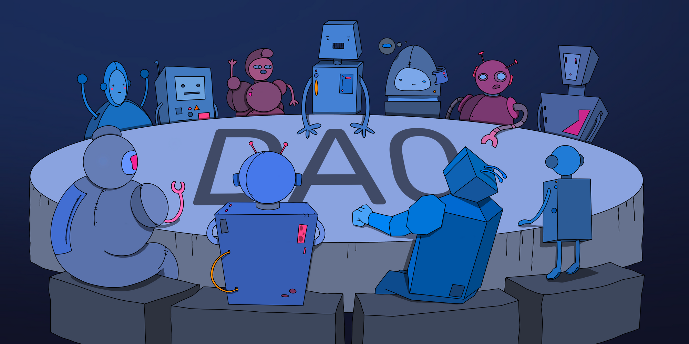

# Overview&#x20;

Gearbox Protocol brings you composable leverage, allowing anyone to margin trade on Uniswap, leverage farm on Curve, leverage stake on Lido, and use 10X more capital on protocols you love. Making decentralized leverage a reality thanks to Credit Account abstraction!

Gearbox Protocol uses Credit Account abstraction to bring together lending and prime brokerage in the same protocol. Lenders deposit assets to [earn passive yield](lending-market/manage-liquidity.md). Meanwhile, the composable leverage side users borrow these assets to create spot leverage positions, which can be used across DeFi. That could be margin trading on Uniswap, farming on Curve and Balancer, leverage staking on Lido, running delta-neutral complex strategies, and more. All of that is made possible with Gearbox’s innovative [Credit Account](overview/credit-account/) abstraction, creating the base layer of DeFi leverage. [See how it works.](overview/how-it-works.md)&#x20;

> The core vision is to become a **leverage / credit layer**. You can envision building your own DeFi protocol and just making a “take leverage with Gearbox” as a button. And _bam_ - your users are now more capital efficient. Check this page to understand why [composable leverage 2.0 is cool](leverage-2.0-is...-composable.md)!

***

### **Where is the DAO, how can I contribute?**

Gearbox is a DAO, run by various contributors and initiatives. The protocol and assets are never in custody of any one single person. You can be in a DAO but not be 24/7 active, which is okay. There are different ways to get involved and get rewarded for your time and skills. See more:



<figure><figcaption>
<a href="https://gearboxprotocol.notion.site/Gearbox-DAO-23966f122ae4421492819242b30a0e7a"><strong>https://gearboxprotocol.notion.site/Gearbox-DAO-23966f122ae4421492819242b30a0e7a</strong></a>
</figcaption></figure>

## **Cool Features**


With V3, Gearbox Protocol has become cooler & faster! It has its own **multicall** for complex 1-click transactions, **smart router** for the best automated routing of trades & deposits, **integrations** with Curve + Yearn + Convex + Lido, segmented risks, staking, and more...




* **Composable.** Gearbox does not have its own order book or trading environment. The leverage you get - is used across multiple DeFi protocols and assets, fully composable!
* **0% Funding Rates**. The leverage offered is not based on derivative positions but is instead executed with real assets on third-party protocols. Because Gearbox does not create its own trading pairs, there is no short/long ratio that needs to be maintained with funding rates.&#x20;
* **Leverage as a Service.** Other protocols can offer leverage to their users with the help of Gearbox Protocol, without modifying anything in their own architecture.
* **Permissionless within safety.** Positions and trades within Credit Accounts can be extended to include complex strategies, for example, making a short position farm in Yearn; or having LP tokens as collateral for more composable actions. In fact, you can make all of these complex things easier to ape into, by using Gearbox's unique multicall features.

### DAO-First Approach to Building

* **Decentralized.** CEXes subjectively define leverage parameters and also keep custody of your funds. With Gearbox, you are always in control of your funds. It's all transparent.
* **Community-driven.** Gearbox Protocol does not have a company responsible for the protocol or on-chain actions. The goal is to make the protocol work based on how the community wants it.&#x20;
* Аrom _day 0_ the focus has been on community-first [launch-phases](overview/launch-phases/ "mention").

_MarketMake ETHGlobal 2021 hackathon finalist_ 🎆
