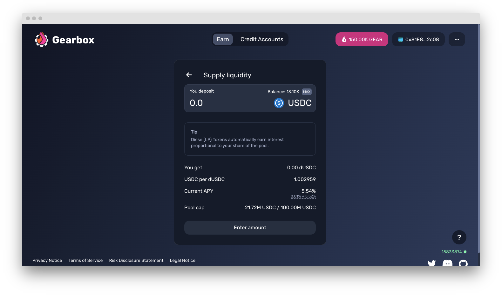

# Lending Dashboard - How to supply or withdraw assets

## Lending Assets

**Step 1.** Go to [Passive Pools](https://app.gearbox.fi/pools) page and click _Supply_ on the asset you want to supply.

<figure><figcaption></figcaption></figure>

**Step 2.** Specify the amount you want to supply or just click on _MAX_.

<figure><figcaption></figcaption></figure>

**Step 3.** First click _Approve_ and wait for the transaction to be confirmed. Then, click _Supply_ and wait for the confirmation. When a transaction is confirmed, you will receive [diesel tokens](pools-and-apy.md#what-is-diesel-token).&#x20;

<figure><figcaption>
Approve the asset you want to supply
</figcaption></figure>

## Withdrawing liquidity

**Step 1.** Go to [Passive Pools](https://app.gearbox.fi/pools) page and click _Withdraw_ on the asset you want to withdraw.

<figure><figcaption></figcaption></figure>

**Step 2.** Specify the amount you want to withdraw if you want to take out a bit or click _MAX_ if all.

<figure><figcaption></figcaption></figure>

**Step 3.** First click _Approve_ and wait for the transaction to be confirmed. Then click _Withdraw_ and wait for the confirmation. When a transaction is confirmed, you will receive back your assets.


Usually, in DeFi protocols forced liquidation is not implemented. This creates the risk of insufficient liquidity for the withdrawal operation. To mitigate this risk, the parameters for managing the interest rate curve of the pool are introduced (interest rate depends on utilization ratio of the pool). If the utilization of the pool is too high, governance can increase these parameters and thereby make lending more expensive. This will encourage borrowers to close loans and thereby reduce pool utilization.



Did you find a bug with the interface, something didn't work as you think it should have, or you have a suggestion on how to improve the user experience? [Report](https://discord.gg/5YuHH9tvms) on Discord!

