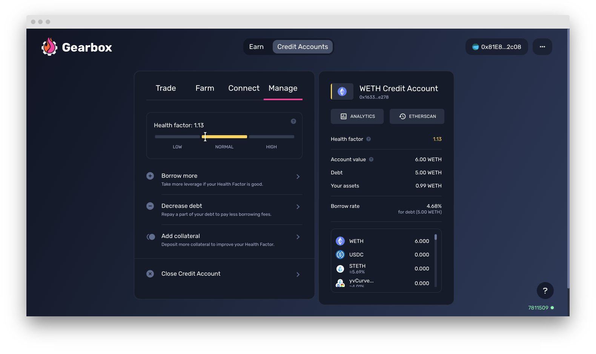

# Inside a Credit Account


Learn [how to open a Credit Account](../how-to-open-account.md) if you have not done it yet.


### Operating a Credit Account

Post opening a Credit Account and taking a leverage position, you'll be able to see an interface that looks like the one below:

<figure><figcaption></figcaption></figure>

There are 4 tabs inside a Credit Account that let you operate and utilise it to the max potential.

1. **Trade:** This is where you can see the leveraged funds you have as well as swap them for a different assets. Swapping can affect your HF so take note of the same by monitoring the right side of the screen. Usually, the interface would give a preview of your HF change.


[trade-swapping-assets.md](trade-swapping-assets.md)


&#x20;2\.  **Farm:** Farm is where the real alpha lies. All the strategies for the biggest vaults and pools in DeFi that you want to ape into are available in farm without you having to hop protocol from protocol. You just need to select which pool/vault you want to go deploy in, and done.&#x20;

<figure><figcaption></figcaption></figure>

&#x20;3\.  **Connect:** Connect is what enables you to use native interfaces of the integrated protocols, thanks to Wallet Connect. You can use them if you like the familiarity but Single Click Strategies and the Farm option already have them available with way more convenience.&#x20;


[connect-wallet-connect.md](connect-wallet-connect.md)


&#x20;4\.  **Manage:** Manage tab lets you take multiple position management actions in order to help you take care of risk as well as to close your position. The options are listed below:

* **Borrow more:** If you have good Health Factor and feel like borrowing more and upping the leverage is worth the play - you can use this feature.
* **Decrease Debt:** You can repay part of your debt to reduce your risk or to reduce the borrow fee you pay on the capital you borrow.
* **Add collateral:** The easiest way to to improve your Health Factor if your Health Factor is getting close to liquidations level, which is < 1.
* **Close Credit Account:** The below page will help you manage the same.


[how-to-close-account.md](how-to-close-account.md)


<figure><figcaption></figcaption></figure>

While these are about the tabs for a credit account, there are certain parameters and values you need to take care of too. They are listed below.

### Account Parameters

At the top, you can see the balance of your Credit Account denominated in the underlying asset you opened your account in (it uses ChainLink oracle prices to calculate these values).

* **Health Factor** - your Credit Account can be liquidated if it falls below 1;
* **Account Value** - current value of Credit Account, denominated in the underlying asset;
* **Debt** - total value of the underlying asset you have borrowed from the protocol;
* **Your assets** - total value in the underlying asset that is your collateral;
* **Analytics** - check the stats of the pool and other charts in Gearbox-native analytics;
* **Etherscan** - see your Credit Account's address, and the transactions on-chain.
* **Tokens** - the list of allowed tokens as per the policy which you can trade among.

<figure><figcaption></figcaption></figure>


Did you find a bug with the interface, something didn't work as you think it should have, or you have a suggestion on how to improve the user experience? [Suggest](https://discord.gg/hF3QvX2vgt) on Discord!

