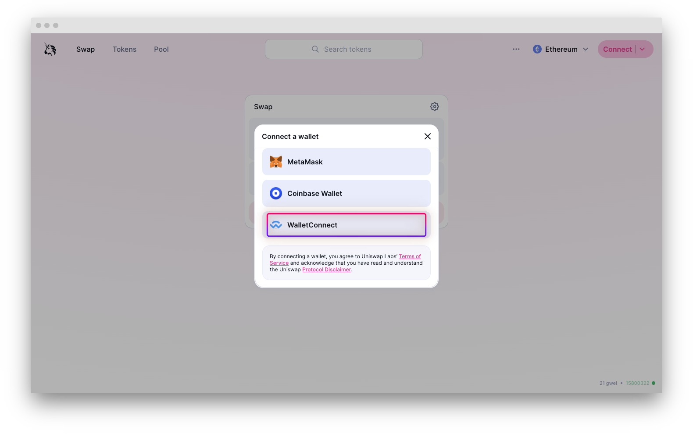
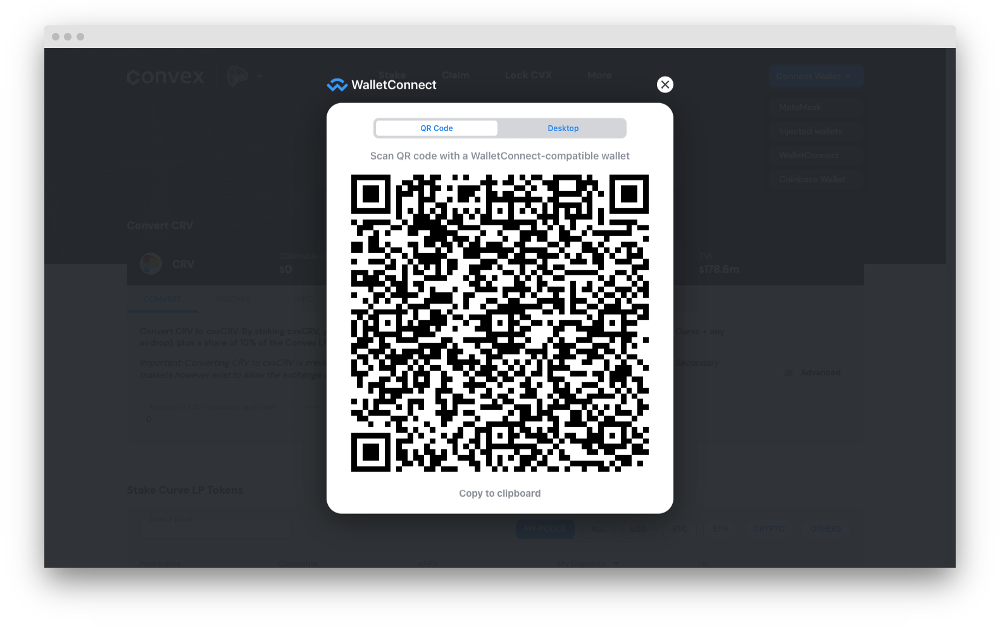

# Connect: Wallet Connect

Using the Wallet Connect integration, you can use leverage on native interfaces of your favorite DeFi protocols. That's right, interfaces of other protocols don't even have to integrate Gearbox Protocol - you simply connect your Credit Account wallet instead of your regular Metamask obe... and there you go - now you can trade with larger positions thanks to Gearbox leverage!&#x20;

1. Open _Connect_ page.

<figure><figcaption></figcaption></figure>

2\. Open another page in your browser and go to dApp you want to use with leverage.


You can only interact with the allowed protocol list as per Gearbox governance. You can see their list on the main Credit Accounts page, and also on the [Integration page here in docs](../../overview/integrations.md). Didn’t find a protocol? Propose to Gearbox DAO to add your favorite protocol!


3\. Connect on that interface using WalletConnect.&#x20;

<figure><figcaption></figcaption></figure>

4\. Click _Copy to clipboard_ in the opened WalletConnect integration interface.&#x20;

<figure><figcaption></figcaption></figure>

5\. Now return to the Gearbox Application page (as you can remember it is still opened on another page in your browser), paste copied into the input field, and click _Connect_. &#x20;

<figure><figcaption></figcaption></figure>

6\. Voila! Now you can return to native dApp interface of the protocol you were using, and use it as you are already familiar with. You can sign transactions with Metamask as you are used to.


Did you find a bug with the interface, something didn't work as you think it should have, or you have a suggestion on how to improve the user experience? [Report](https://discord.gg/5YuHH9tvms) or [suggest](https://discord.gg/hF3QvX2vgt) on Discord!

