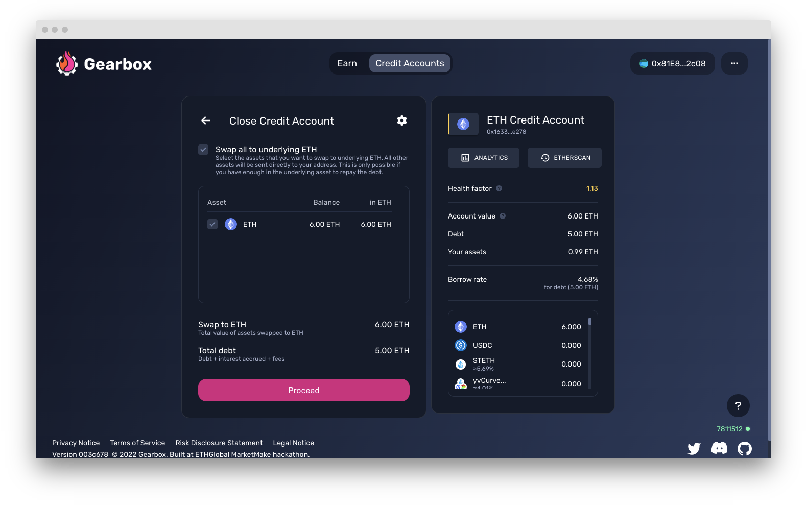

# How to close a Credit Account

Before you close a Credit Account, either while famring or margin trading, the protocol would want you to pay back what you owe. That is the loan you took and the interest accrued to it over the time you used the Credit Account. There are two options to pay back:&#x20;

* Use the Credit Account's funds to repay the debt by automatically swapping all positions inside it to the underlying asset, from which the debt (notional loan + interest accrued) are subtracted and then the difference is given back to you. The better you traded, the more you will get.
* Use your own funds to repay the debt in the underlying asset - and get all the assets from the Credit Account back to your wallet. You essentially prepay the debt, and then the Credit Account releases all the funds on its balance to your personal wallet.&#x20;


**Option number two is preferred in case you really like the assets** you have on your Credit Account and don't want to trade there-and-back and just want to keep the assets. Remember that keeping passive positions on a Credit Account still accrues **interest**.

Another reason why **option number two is preferred is because you as a user can slowly trade out of the positions instead of market-selling them**. In case your positions are large, some of the assets on your Credit Account could incur high slippage which the protocol will not allow you to perform such an action and will require you to input larger slippage tolerance.


## Option 1:  **Swap all assets to the underlying and repay the debt**

The protocol will exchange all the non-underlying asset funds to the underlying asset on DEXes and repay your debt. You will receive the remaining funds to your personal wallet.

**Step I-1.** Click _Close_ button

<figure><figcaption></figcaption></figure>

**Step I-2.** Choose the maximum size of the slippage that you will tolerate in the options page in the top right corner, and click _Swap and get tokens_ button. If the price falls by more than the slippage while your trade is being confirmed, the trade will be reverted.

<figure><figcaption></figcaption></figure>

## Option 2: **C**lose a Credit Account by repaying the debt and keeping some assets

You repay the loan with your own funds. This means you have more funds on your personal wallet. After repayment is done, the assets which were on your Credit Account will be sent to your wallet. This option is possible only if your personal wallet balance in the denominated asset is at least of the amount required for repaying the debt.


Did you find a bug with the interface, something didn't work as you think it should have, or you have a suggestion on how to improve the user experience? [Report](https://discord.gg/5YuHH9tvms) on Discord!

