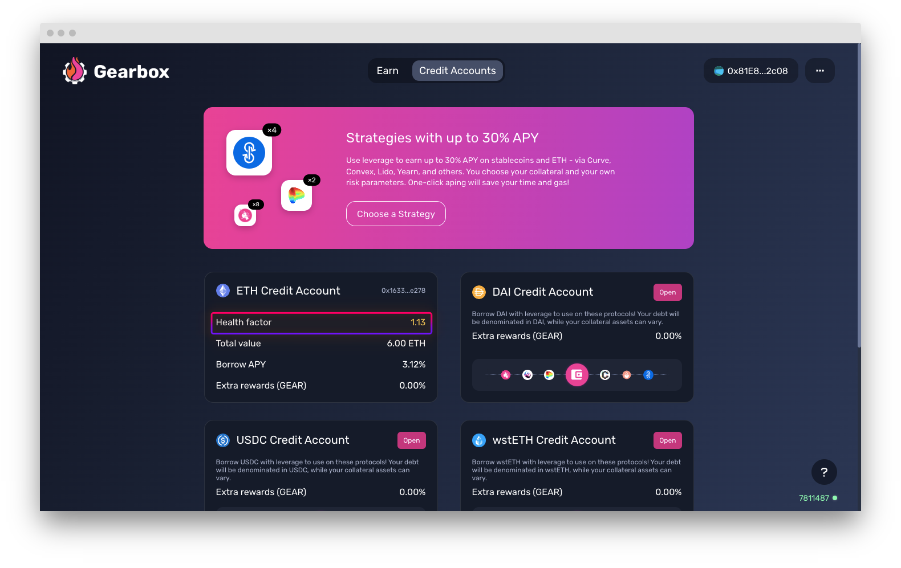

# How to avoid liquidations

Liquidations are there to protect liquidity providers' capital which by default shouldn't be exposed to directional market risk which traders & farmers take. As a leverage user - you can avoid liquidations, which also saves you from the [fees](../../overview/protocol-fees.md) paid to liquidators & the protocol.


[liquidations](../../overview/liquidations/)


[Health Factor ](../../overview/liquidations/#what-is-a-health-factor)is the representation of your Credit Account's performance. Keep it high enough, and it should generally be fine - unless a major market event comes where your positions could go down 25% or more in a matter of minutes. Make sure to keep it high and watch out!


Keep your health factor as high as possible. **Make sure it doesn't drop below 1.**


### What I can do if my Health Factor is close to 1?&#x20;


In case you are in position which has correlated collateral to debt \[like stablecoin debt to a stablecoin farm [leveraged-stablecoin-farming.md](../strategies/leveraged-stablecoin-farming.md "mention"), or an ETH debt to leveraged liquid staking position [leveraged-liquid-staking.md](../strategies/leveraged-liquid-staking.md "mention") - you can take higher leverage as the LTVs of your position <> debt are essentially correlated and are high. As such, it allows you to take 10x leverage in some extreme cases. Then it's normal to have low HF.

Read about that in [pro-leverage-bible.md](../pro-leverage-bible.md "mention").


1. **Add collateral**: the easiest method to improve your Health Factor is simply by adding more collateral in the form of the base asset that you opened your credit account in. If this isn't a possibility you can follow the below options.

<figure><figcaption></figcaption></figure>

&#x20;2\.  **Change your strategy:** If you are in a strategy that has a directional trade that's leading to the HF dropping, a possible better idea could be to change to a strategy with stables or lesser volatile/base asset to preserve your Credit Account. That is, if your debt is stables. If your debt is ETH and you are short ETH in a bull market... _maybe join the ultrasound side, anon-kun._

&#x20;3\.  **Decrease debt:** Add some of the collateral back to the CA in the form of the base asset you borrowed, this will help you lower your leverage and thus improve your health factor


[how-to-close-account.md](how-to-close-account.md)


### Checking Health Factor of your Credit Account

In the [Credit Account's page](https://app.beta.gearbox.fi/accounts) you can check health factors of all your Credit Accounts:

<figure><figcaption></figcaption></figure>

Also you can check health factor inside the Credit Account. _All of these stats are of course also fully on-chain and do not require any interfaces, just so you know_.

<figure><figcaption></figcaption></figure>


Anybody can run a liquidator bot and secure the protocol. You can chat about setting up your bot and other liquidator-things in [Discord](https://discord.gg/wmydr8JfcP). Help users minimize the [risks](../../risk-and-security/risks-terms.md)!

