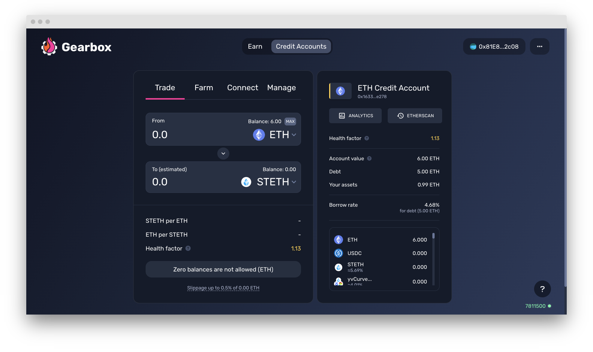

# Trade: swapping assets

The trade tab lets you trade (swap) any asset from one to another, as long as it is on the [allowedlist-policy](../../overview/credit-account/allowedlist-policy/ "mention"). You can see that list by scrolling on the right tab of the dashboard.


[allowedlist-policy](../../overview/credit-account/allowedlist-policy/)


Swapping your asset to another has direct impact on your Health Factor, so please do keep a check on it in order to make sure you don't run into a risk of a liquidation. In most cases, the interface would give you a preview of your approximate Health Factor change prior to a swap.

<figure><figcaption></figcaption></figure>

You can also use native interfaces of Uniswap/Curve/Sushiswap with the this cool feature:


[Broken link](broken-reference)

