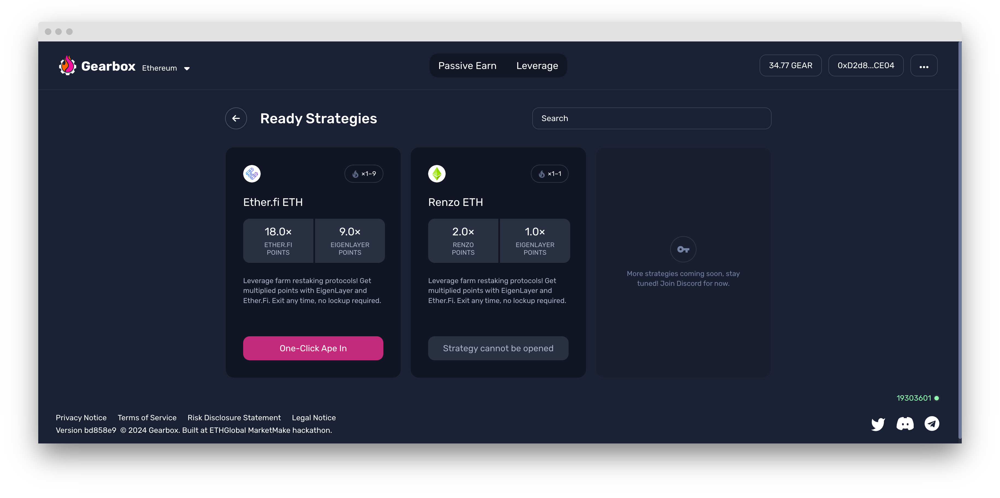

# Leverage Points & Restaking


You don't need ninja approval for leverage points. You need the [SBT ninja pass](https://tally.so/r/3XoVzY) for leverage farming Curve, Balancer, and other [farming integrations](strategies/). But not for points!


There's not much that you need to say beyond "Earn 10 times more EIGEN, Ethena shards, and EtherFi/Renzo points" to push this product. However, understanding why _leveraged points change the fabric of society_ and where the yields come from - will help you make better informed decisions.

### Differences of leverage points vs regular leverage farming

Leverage borrowers who want to farm points are prepared to pay high rates today - to get higher rates “tomorrow” due to the airdrops earned in the future (points accrued). That's their logic.

In that sense, **a leverage borrower is still technically leverage farming**… but **negative yields.** _Wait what?!_ - Yes, the organic rates for staking they get today are not large. What these users want is the distribution of tokens due to the points they earn: EigenLayer, Ethena, Renzo, EtherFi, and others stacking up on top of each other. That’s where leverage users today see the \$$.

> EtherFi, Renzo, Kelp, Swell, Puffer, and others - Gearbox can integrate them all.

***

## How to leverage restake & points with Gearbox

Go to [https://app.gearbox.fi/restaking/list](https://app.gearbox.fi/restaking/list) and choose the protocol.&#x20;

<figure><figcaption>
<a href="https://app.gearbox.fi/restaking/list">https://app.gearbox.fi/restaking/list</a>
</figcaption></figure>

* Choose your initial asset(s) which can be multiple, in fact;
* Choose whether you want to swap them to the strategy or [keep them as is](https://docs.gearbox.finance/traders-and-farmers/pro-leverage-bible#a-different-understanding-of-collateral) (you can see below that is says either your deposit and borrowed assets - or just borrowed assets);
* Choose your leverage factor x;
* Check the liquidation price, all the details;
* Sign the asset approval, and then the transaction itself. Done!


Price and liquidity depth of an LRT (be it weETH, ezETH, or something else entirely) is relevant not just from the depeg perspective for liquidations (more on that below), but also in the context of price slippage and price impact. When you trade with $500K size on spot DEXes even without leverage - the same things happen. Consider executing large sizes gradually, both when entering and exiting a position. Otherwise, large slippage and price impact can eat into your initial deposit and create a temporary loss.

Gearbox' smart router helps you execute trades and farms in one-go (multicall), but the liquidity and prices are derived from DEXes. The depeer their liquidity is, the better the execution. Also, keep in mind things like sandwiching, so use [MEV blocker](https://mevblocker.io/).


<figure><figcaption>
This is the next window after choosing in <a href="https://app.gearbox.fi/restaking/list">https://app.gearbox.fi/restaking/list</a>.
</figcaption></figure>

What happens underneath is:

1. You borrow [real ETH or USDC from passive lenders](../lending-market/pools-and-apy/) with leverage (who earn interest passively);
2. Together with your initial funds and borrowed funds, a [Credit Account](../overview/credit-account/) is opened for you;
3. And then your Credit Account marketbuys the chosen liquid restaking token (LRT).

Gearbox' multicall helps you do it all in one go, so you don't have to confirm many transactions one after another. That saves you money on gas fees and time on signing it all.

### Feel free to exit any time: always liquid


You don't have to pay fees forever, you can stop at any time. Just don't fully close your Credit Account, because your points earned accrue and will be claimable via it later. That is, once those airdrops actually go live. See below on how to correctly "exit" leverage restaking.


Gearbox is a superior offering compared to alternatives in many ways, because you can get in and out of a position at any time. There are a few ways you can exit a liquid restaking position in case you either don't want to pay any more fees or you just grew bored of this strategy. Here are the ways:

* You want to exit all leverage: When you go to "Close Credit Account" inside the dashboard, choose "keep 0-debt account". That means your Credit Account will still remain yours while you wait for the airdrops, but you won't be paying fees anymore. No locking you up, remain free.

<figure><figcaption>
See the third option if you want to keep your CA, but get the funds out and stop paying.
</figcaption></figure>

* You want to change the strategy: then don't close your Credit Account either, just exit the position inside the dashboard and ape into something else right in there. Either another LRT or maybe just [vanilla farming](strategies/). That way, you can keep farming something else while waiting. This way, you pay different yet lower fees depending on what other strategy you choose.

<figure><figcaption>
You can enter-exit farms from the same Credit Account, see it like your leveraged wallet.
</figcaption></figure>

### Liquidations and risks

When it comes to liquidations, your liquidation price is mentioned in the dApp when you open a position (on the right). You can also manually calculate it if you follow the steps from [here](pro-leverage-bible.md#how-to-max-out...-but-kinda-safely). Make sure to not max out the leverage, because oracle deviations might happen. You kind of only care about the LRT/ETH price (because ETH is your debt, so your position is somewhat correlated), but the oracle reports usd values first and then converts to ETH (fixing right now). These LRT assets are new, so depegs can happen during large swings. Keep it in mind and don't get liquidated.

* Check [how to avoid liquidations](credit-account-dashboard-overview/kak-ne-byt-rekt.md).
* Check what [fees](../overview/protocol-fees.md) the protocol has (no quota flat fee for leverage restaking).

Another thing to keep in mind is the borrow rates. The higher the leverage you've chosen, the faster those rates eat your initial deposit and lower your Health Factor. You don't have to check your positions daily per se, but do check them every now and then to make sure you are in the safe zone.

We have a [charts dApp](https://charts.gearbox.finance/accounts) for checking these things too.


Do make sure to go through all the pointers in the Leverage Bible to learn the tricks. You should check it out to understand the concept of collateral, how oracles work, and so on:



[pro-leverage-bible.md](pro-leverage-bible.md)


Similar risks apply to leverage restaking as to anything you do across DeFi. There are no extra risks specific to Gearbox. In some sense, Gearbox can be seen as a safer avenue, because every user has their own Credit Account (isolated smart contract) so the architecture isn't just 2 pools - but many more modular pieces. You can check the information on [audits & audits](../risk-and-security/audits-bug-bounty.md) as well as [general risks](../risk-and-security/risks-terms.md).

Jump in [Discord](https://discord.com/invite/gearbox) ot [Telegram](https://t.me/GearboxProtocol) to ask anything. Happy restaking, get 'em points!
