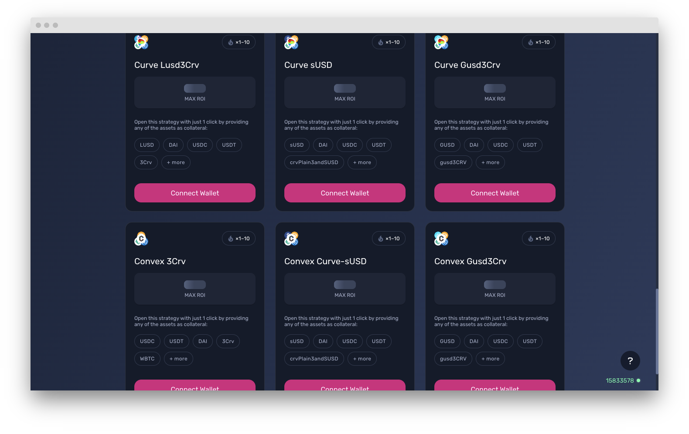

# Leveraged Stablecoin Farming

<figure><figcaption></figcaption></figure>

### 1. Metapool/3Pool(USDC+USDT+DAI)

#### a. Curve 3Pool

The Curve 3Pool is one of the most important stablecoin pools in all of DeFi — it underpins much of the Curve ecosystem because many of their other pools are made up for the 3pool + 1 additional asset (known as Curve metapools).

It also holds almost $1b in assets at the moment. While this pool doesn’t have very high APY, this pool is broadly seen as very safe as long as you are happy to hold the underlying stables (USDC, USDT, DAI). Basically, the risks you are taking are Curve protocol risks + one of the 3 assets depegging. That’s a pretty low low risk compared to whatever else you can face in DeFi.

#### **b. Convex 3CRV**

### 2. FRAX Strategies

#### a. Curve FRAX3CRV

The **FRAX3crv pool** is the type where a pool pairs 1 asset with the 3CRV Pool token. So by participating in this pool, you’re (very approximately) holding 50% FRAX and 50% 3CRV, which is made up of DAI, USDC, and USDT. If FRAX is your stablecoin of choice, then this Vault is a decent option for you to earn yield on FRAX as a stablecoin.

#### b. Convex FRAX3CRV

Convex FRAX3CRV is the convex vault for the curve LP pool, it is boosted by the CVX emissions on convex.

#### c. Curve FRAX Pool yVault 

The yVault is formed by the LP tokens of the above mentioned Curve pool. These LP tokens from Curve are then further deposited in Convex for additional yield from CVX emissions. The CVX is then sold and assets redeposited to increase yield. You can execute this in one click as well.

### 3. LUSD Strategy

#### a. Curve LUSD3CRV

The **LUSD3crv pool** is another one of these pools with 1 asset + 3CRV. In this case, the 1 asset is LUSD, which again means that you’re holding 50% LUSD and 50% a mixture of DAI, USDC, and USDT.

LUSD is generally viewed as one of the most decentralized and censorship resistant stablecoins (the design is similar to original design of DAI, where the only collateral used for LUSD is ETH). So if you’re a decentralization maxi but you still want to earn yield on stables, this LUSD pool might be a reasonably good solution for you.&#x20;

Just keep in mind that recently LUSD has been >$1 peg, so entering the pool (but so is exiting) yields slippage if you are using another stablecoin other than LUSD itself.

**b. Convex LUSD3CRV**

Like the above two, this is the convex vault for the curve pool to earn boosted rewards

### 4. GUSD Strategy

#### a. Curve GUSD3CRV

Similar to the above 2, **GUSD3crv pool** on Curve also functions with 1 asset being clubbed with the 3CRV. GUSD is a 1:1 USD-backed stablecoin issued by Gemini. You can redeem a GUSD for $1 at Gemini.&#x20;

**b. Convex vault for Curve GUSD3CRV**

### **5. sUSD Strategies**

**a. Curve sUSD**

The Curve sUSD pool which this vault is built on predates the metapool design and is instead made up for (approximately, in an ideal world) 25% each of SUSD, USDC, USDT, and DAI.

sUSD is an overcollateralized stablecoin by Synthetix protocol. You can learn more about Synthetix here. sUSD is considered by most to be pretty decentralized, as sUSD is entirely backed by staked SNX as a part of the broader Synthetix ecosystem of synthetic assets and derivatives.

If you’re a believer in the Synthetix ecosystem then this Curve sUSD Pool might make sense as a place for you to park your stablecoins to earn yield.

**b. Convex Curve sUSD vault**

Try these vaults out here:&#x20;


