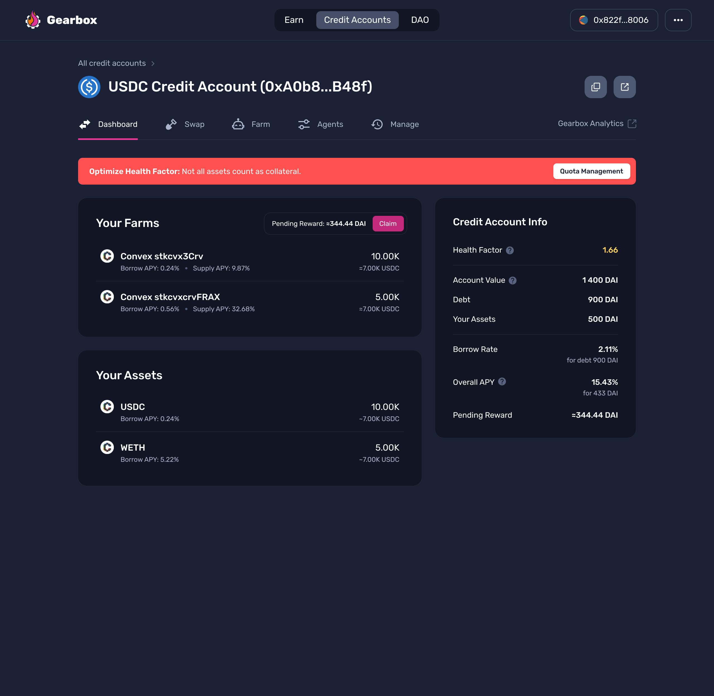

# Farming- Long and Short

#### Farming Long

If you want to go long ETH to USDC, you need to open a Credit Account denominated in a stable coin. Then you can use those extra stables you got from leverage and buy more ETH with your Credit Account. The same strategy goes for going long ETH against BTC or some other asset.

[Open Credit Account and try it](https://app.gearbox.fi/).

After that, you can put the ETH into Yearn or whatever other farming protocol is available. Depending on interest rates in Gearbox Protocol and interest rates in Yearn or another farming protocol, you can actually get a _self-repaying long or even a net-paying long_.

#### Farming Short

If you want to go short ETH to USD, you need to open a Credit Account denominated in ETH.&#x20;

Then you can sell all the ETH within your Credit Account to USDC. You can use those USDC to leverage farm or do something else then. The same strategy goes for going short WBTC against ETH or some other asset available.

After that, you can put the USDC into Yearn or whatever other farming protocol is available. depending on interest rates in Gearbox Protocol and interest rates in Yearn or another farming protocol, you can actually get a _self-repaying short or even a net-paying short_.

<figure><figcaption></figcaption></figure>


[how-to-open-account.md](../how-to-open-account.md)


It doesn't matter which third-party protocol - Uniswap, Sushiswap, etc. - you choose. You decide where you want the trade to be executed. After a transaction is confirmed, your position is in effect.
